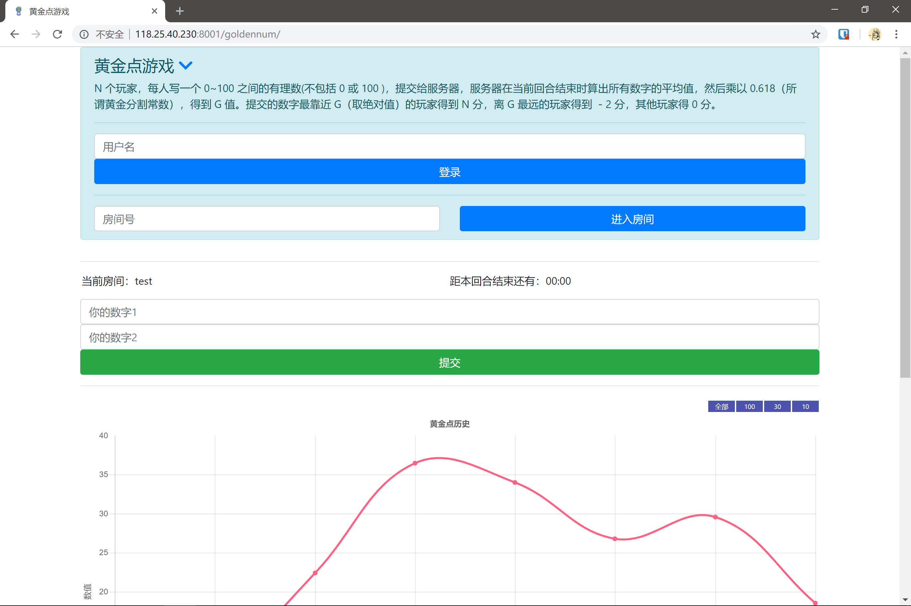

# 黄金点游戏

> ♔来一场紧张刺激的 ~~飞行棋~~ 黄金点游戏吧！

## 游戏规则

N 个玩家，每人写 **2** 个 **0~100** 之间的有理数 **（不包括 0 或 100 )** ，提交给服务器，服务器在当前回合结束时算出所有数字的 **平均值** ，然后乘以 **0.618**（所谓黄金分割常数），得到 G 值。提交的数字最靠近 G（取绝对值）的玩家得到 **N-2** 分，离 G 最远的玩家得到 **-2** 分，其他玩家得 0 分。

## 运行demo与截图

[Demo](http://118.25.40.230:8001/goldennum)

测试房间：test



## 管理员文档

### 部署

该repo提供了docker部署方式，docker的安装详见其[官方文档](https://docs.docker.com/install/overview/)

1. 新建文件夹
2. 下载该repo的[tools/docker-deploy](https://github.com/Botbattle-net/BOTBattle.net/tree/master/tools/docker-deploy)文件夹下的两个文件到该文件夹
3. 在文件所在目录输入 ```docker build --build-arg default_key="这里填你的secret key" -t botbattle:botbattle .
```
4. 待image拉取成功后启动 ```docker run -p 8001:8001 --name botbattle botbattle```
5. 访问 ```服务器ip:8001/goldennum``` 进入游戏页面
6. 停止游戏 ```docker stop botbattle```

### 用户接口

|url|方法|功能|
|:-|:-|:-|
|/userReg/|GET|用户注册登录|
|/userOut/|GET|用户注销|
|/userAct/|GET|提交操作|
|/getStatus/|GET|获取游戏状态|

##### 用户注册登陆

`GET /userReg/?name=$username`

|参数|含义|
|:-|:-|
|`$username`|要注册登录的用户名|

|返回值|含义|
|:-|:-|
|Invalid request|参数错误|
|You have logged in|已经登陆|
|User exist|已登录, 但所请求的用户名已经登陆|
|User login success|重新登陆成功|
|User register success|用户注册成功|

#### 用户注销

`GET /userOut/`

|返回值|含义|
|:-|:-|
|No login|未登录|
|Logout success|用户注销成功|

#### 提交操作

`GET /userAct/?roomid=$roomid&num1=$num1&num2=$num2`

|参数|含义|
|:-|:-|
|`roomid`|房间号|
|`num1`|操作1|
|`num2`|操作2|

|返回值|含义|
|:-|:-|
|Invalid request|参数错误|
|No login|未登录|
|Numbers overflow|操作不合标准|
|Upload success|提交成功|

#### 获取游戏状态

`GET /getStatus/?roomid=$roomid`

|参数|含义|
|:-|:-|
|`roomid`|房间号|

返回值样例:

```js
{
    "status": "success",
    "roomid": "fc1",
    "history": [
        12.6,
        9.2,
        3.2
    ],
    "users": [
        {
            "userName": "frank",
            "score": 12
        },
        {
            "userName": "jack",
            "score": 3
        },
        {
            "userName": "tom",
            "score": -4
        }
    ],
    "time": 42
}
```

|键|含义|
|:-|:-|
|status|请求状态|
|roomid|房间名称|
|history|数组, 历史黄金点数据, 从远到近排序|
|users|当前房间内用户, 分数从高到低|
|time|当前回合剩余时间(s)|
