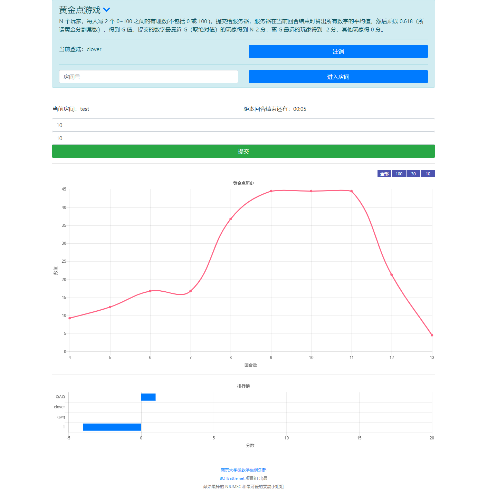

# DEPRECATED, USE [forewing/goldennum](https://github.com/forewing/goldennum)
# 已弃用，请使用重制版

# 黄金点游戏_弃用版

> ♔来一场紧张刺激的 ~~飞行棋~~ 黄金点游戏吧！

## 游戏规则

N 个玩家，每人写 **2** 个 **0~100** 之间的有理数 **（不包括 0 或 100 )** ，提交给服务器，服务器在当前回合结束时算出所有数字的 **平均值** ，然后乘以 **0.618**（所谓黄金分割常数），得到 G 值。提交的数字最靠近 G（取绝对值）的玩家得到 **N-2** 分，离 G 最远的玩家得到 **-2** 分，其他玩家得 0 分。

## 运行效果与截图

[Demo](http://118.25.40.230:8001/goldennum) 测试房间：test

## 相关文档

* [用户文档](docs/user.md)
* [管理员文档](docs/admin.md)
* [开发者文档](docs/developer.md)
